# Git

[Git Quick Guide](https://github.com/ag143/git/blob/master/git_quick_guide.md)

[Git Detail Guide](https://github.com/ag143/git/blob/master/git_detail_guide.md)

[Reference guide](https://git-scm.com/docs)

[https://git-scm.com/docs](https://git-scm.com/docs)

# Setup and Config
## git
> Git is a fast, scalable, distributed revision control system with an unusually rich command set that provides both high-level operations and full access to internals.
## config
> git config --global user.email "your_email@example.com"
> git config --global user.name "username or ID"
> 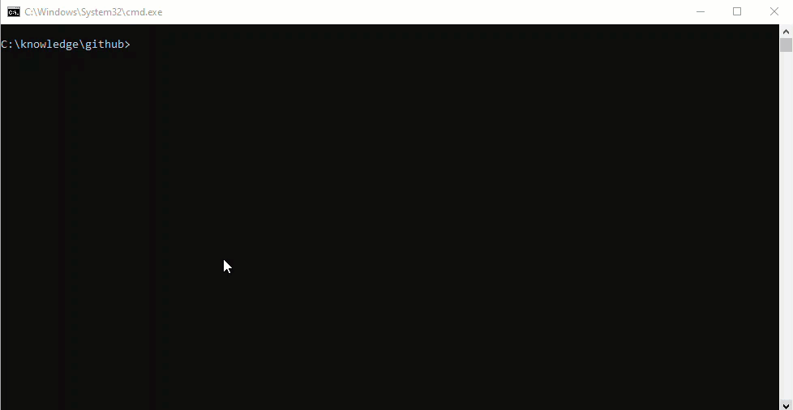
## help
> 
## bugreport
> .
# Getting and Creating Projects
> .
# init
> 
> .
## clone
> 
> .
# Basic Snapshotting
> .
## add
> 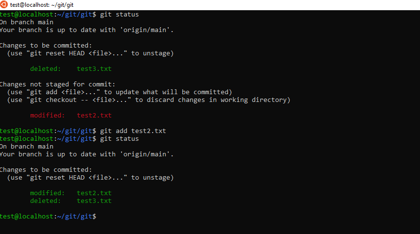
> .
## status
> 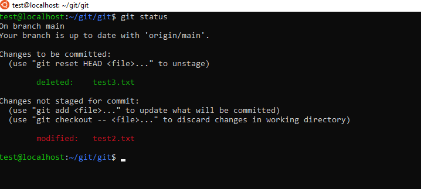
> .
## diff
> 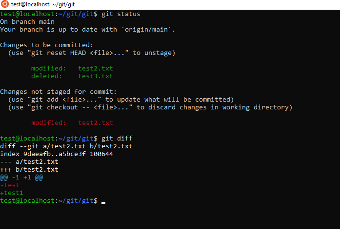
> .
## commit
> 
> .
## notes
> .
## restore
> .
## reset
> 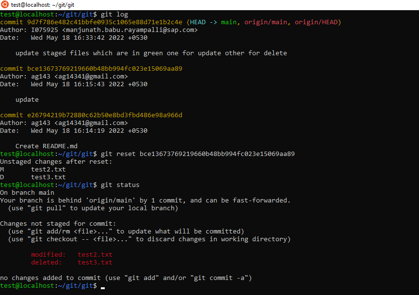
> .
## rm
> 
> .
## mv
> 
> .
# Branching and Merging
> .
## branch
> 
> .
## checkout
> 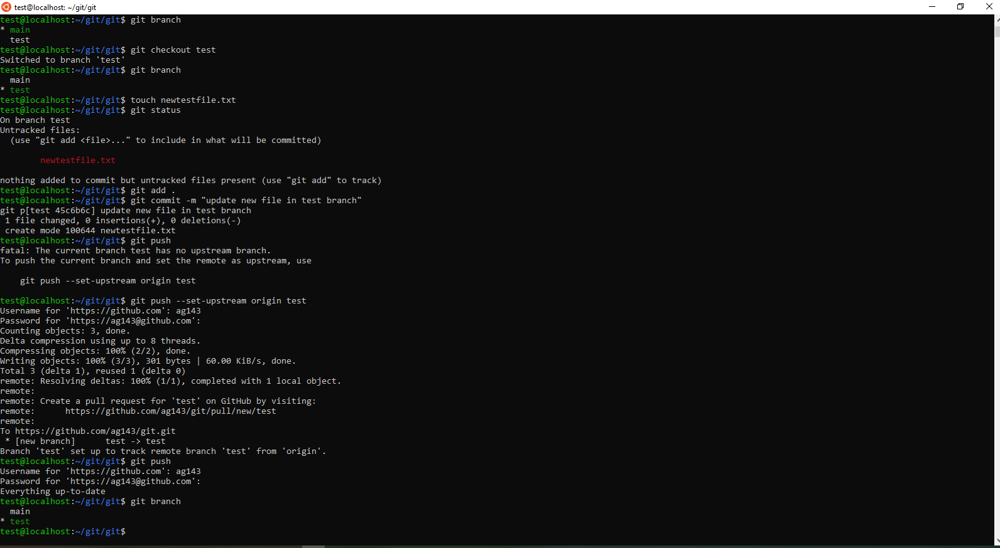
> .
## switch
> .
## merge
> 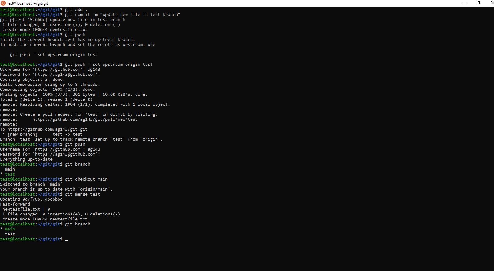
> .
## mergetool
> .
## log
> 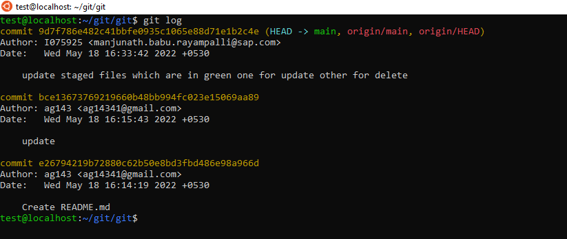
> .
## stash
> 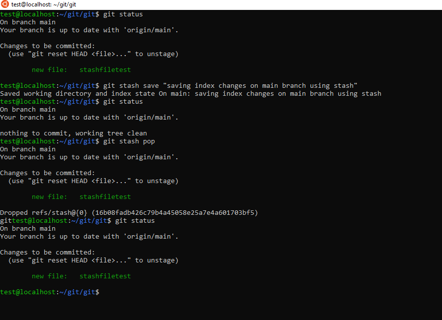
> .
## tag
> 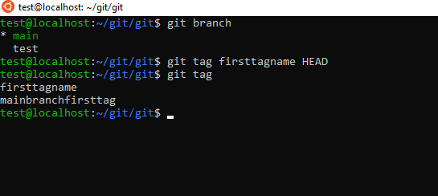
> .
## worktree
> 
> .
# Sharing and Updating Projects
> .
## fetch
> .
## pull
> .
## push
> 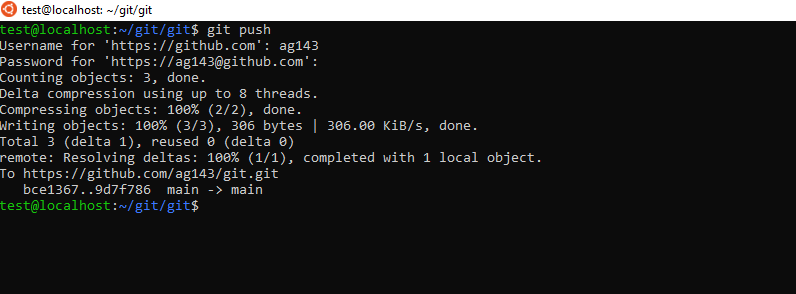
> .
## remote
> .
## submodule
> .
## Inspection and Comparison
> .
## show
> 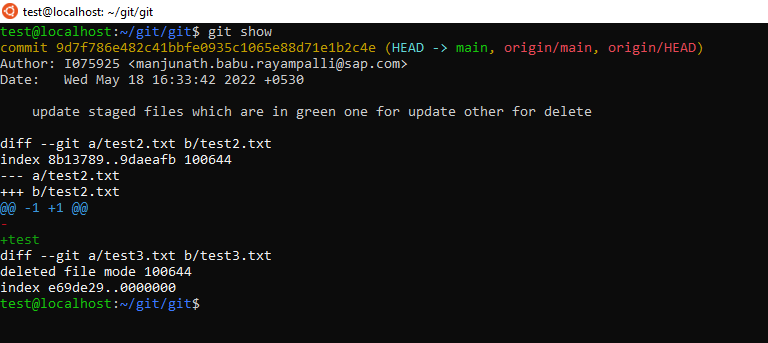
> .
## log
> 
> .
## diff
> 
> .
## difftool
> .
## range-diff
> .
## shortlog
> 
> .
## describe
> .
# Patching
> .
## apply
> .
## cherry-pick
> .
## diff
> .
## rebase
> .
## revert
> .
# Debugging
> .
## bisect
> .
## blame
> .
## grep
> .
# Guides
> .
## gitattributes
> .
## Command-line interface conventions
> .
## Everyday Git
> .
## Frequently Asked Questions (FAQ)
> .
## Glossary
> .
## Hooks
> .
## gitignore
> .
## gitmodules
> .
## Revisions
> .
## Submodules
> .
## Tutorial
> .
## Workflows
> .
## All guides...
> .
# Email
> .
## am
> .
## apply
> .
## format-patch
> .
## send-email
> .
## request-pull
> .
# External Systems
> .
## svn
> .
## fast-import
> .
## Administration
> .
## clean
> .
## gc
> .
## fsck
> .
## reflog
> .
## filter-branch
> .
## instaweb
> .
## archive
> .
## bundle
> .
## Server Admin
> .
## daemon
> .
## update-server-info
> .
## Plumbing Commands
> .
## cat-file
> .
## check-ignore
> .
## checkout-index
> .
## commit-tree
> .
## count-objects
> .
## diff-index
> .
## for-each-ref
> .
## hash-object
> .
## ls-files
> .
## ls-tree
> .
## merge-base
> .
## read-tree
> .
## rev-list
> .
## rev-parse
> .
## show-ref
> .
## symbolic-ref
> .
## update-index
> .
## update-ref
> .
## verify-pack
> .
## write-tree
> .

