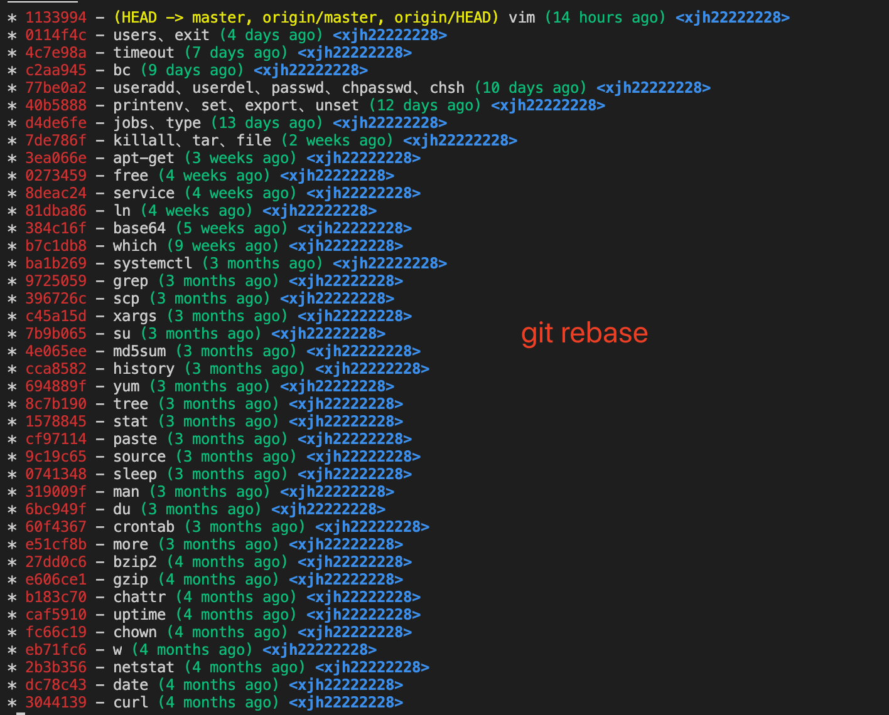
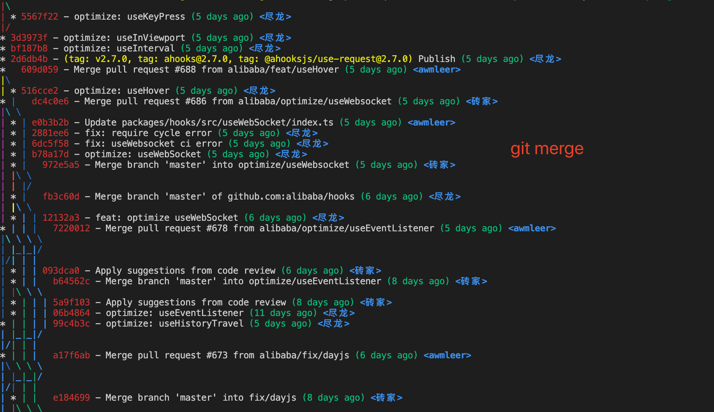

forked from https://github.com/xjh22222228/git-manual/blob/main/README.md

<p align="center">
  
  <br />
  <b>Git Commands Reference Manual</b>
  <p align="center">Basically covers the git commands used in development, which can meet daily needs</p>
  <p align="center">Easy to understand example, 30 minutes quick start</p>
  <p align="center">
    <a href="https://github.com/xjh22222228/git-manual/stargazers"></a>
    
    <a href="https://hits.dwyl.com/xjh22222228/git-manual">
      
    </a>
  </p>
</p>


Note: In October 2020 GitHub has renamed the default branch `master` to the `main` branch.


---


# content
- [config](#config)
- [Initialize warehouse](#Initialize warehouse)
- [clone repository](#clone repository)
- [Manage warehouse](#Manage warehouse)
- [Temporary file](#Temporary file)
- [submit file](#submit file)
- [Push remote](#Push remote)
- [View branch](#View branch)
- [switch branch](#switch branch)
- [create branch](#create branch)
- [delete branch](#delete branch)
- [rename branch](#rename branch)
- [transfer commit](#transfer commit)
- [Temporary save](#temporary save)
- [file status](#file status)
- [log](#log)
- [blame](#blame)
- [merge](#merge)
- [delete file](#delete file)
- [Restore](#Restore)
- [pull](#pull)
- [move-rename](#move-rename)
- [Compare file content differences](#Compare file content differences)
- [View historical submission information](#View historical submission information)
- [rollback version](#rollback version)
- [undo](#undo)
- [tag] (#tag)
- [rebase](#rebase)
- [workflow](#workflow)
- [submodule](#submodule)
- [subtree](#subtree)
- [binary search](#binary search)
- [archive](#archive)
- [format log](#format log)
- [Clear commit history](#Clear commit history)
- [help](#help)
- [commit spec](#commit spec)
- [Resolve conflict](#Resolve conflict)
- [Warehouse Migration](#Warehouse Migration)
- [Fantastic Skills] (#Fantastic Skills)
- [GUI client](#GUIclient)
- [Generate SSH Key](#Generate SSH-Key)
- [other](#other)
- [remember password](#remember password)
- [Clear account](#Clear account)
- [speed up](#speed up)
- [Mind Map](#MindMap)


## configure
```bash
# View global configuration list
git config --global -l
# View local configuration list
git config --local -l

# View all configurations and the files they are in
git config --list --show-origin

# View the set global username/email
git config --global --get user.name
git config --global --get user.email

# Set global username/email
git config --global user.name "xiejiahe"
git config --global user.email "example@example.com"

# Set the user name/email of the local current workspace warehouse
git config --local user.name "xiejiahe"
git config --local user.email "example@example.com"

# delete configuration
git config --unset --global user.name
git config --unset --global user.email
# Modify the default text editor, such as nano
# Common editors: emacs / nano / vim / vi
git config --global core.editor nano

# Set the default differential analysis tool to vimdiff
git config --global merge.tool vimdiff

# Edit the current repository configuration file
git config -e # Equivalent to vi .git/config

# Changes in file permissions will also be considered changes, and file permission changes can be ignored through the following configuration
git config core.fileMode false

# File case is set to be sensitive, git ignores case by default
git config --global core.ignorecase false

# When configuring git pull, all submodule contents are pulled by default
git config submodule.recurse true

# Remember to submit the account password, the account password can be waived for the next operation
git config --global credential.helper store # permanent
git config --global credential.helper cache # Temporary, default 15 minutes
````

#### Command alias configuration
git can use aliases to simplify some complex commands, similar to the [alias](https://github.com/xjh22222228/linux-manual#alias) command.

```bash
# git st is equivalent to git status
git config --global alias.st status

# If added before, you need to add --replace-all to override
git config --global --replace-all alias.st status

# To execute external commands, just add ! in front
git config --global alias.st '!echo hello';
# Add "!" to execute an external command to execute a complex process of merging code, for example:
git config --global alias.mg '!git checkout develop && git pull && git merge master && git checkout -';

# remove the st alias
git config --global --unset alias.st
````


#### configure proxy
```bash
# set up
git config --global https.proxy http://127.0.0.1:1087
git config --global http.proxy http://127.0.0.1:1087

# Check
git config --global --get http.proxy
git config --global --get https.proxy

# cancel proxy
git config --global --unset http.proxy
git config --global --unset https.proxy
````


## Initialize repository
`git init` creates an empty Git repository or reinitializes an existing one

Actually the `git init` command is not used much and is usually done on the GUI.
```bash
# will generate .git in the current directory
git init

# Create in quiet mode, only print errors or warnings
git init -q

# Create a bare repository in the current directory with only all files under .git
git init --bare
````


## Clone the repository
```bash
# https protocol clone
git clone https://github.com/xjh22222228/git-manual.git

# SSH protocol clone
git clone git@github.com:xjh22222228/git-manual.git

# Clone the specified branch, -b specifies the branch name, which actually clones all branches and switches to the develop branch
git clone -b develop https://github.com/xjh22222228/git-manual.git

# --single-branch clone only the specified branch completely
git clone -b develop --single-branch https://github.com/xjh22222228/git-manual.git

# Specify the cloned folder name
git clone https://github.com/xjh22222228/git-manual.git git-study # If followed by . Create in the current directory

# Recursive clone, useful if the project contains submodules
git clone --recursive https://github.com/xjh22222228/git-manual.git

# Shallow clone, the clone depth is 1, only the specified branch is cloned and only the last record is kept, usually used to reduce the clone time and project size
git clone --depth=1 https://github.com/xjh22222228/git-manual.git
git clone --depth=1 --no-single-branch https://github.com/xjh22222228/git-manual.git # --no-single-branch also clones all other branches


# Bare clone, no workspace content, cannot be submitted for modification, generally used to copy warehouses
git clone --bare https://github.com/xjh22222228/git-manual.git

# Mirror clone, which is also a bare clone, is different from including the upstream repository registration
git clone --mirror https://github.com/xjh22222228/git-manual.git
```


#### Clone the specified folder
Some repositories will contain code for clients, servers, etc., but you don't want to clone the entire project completely, but just want to clone a certain folder. At this time, you need to use `sparse checkout`.


To enable sparse detection, two conditions must be met:
- `core.sparsecheckout` is set to true
- `.git/info/sparse-checkout` file listing directories to check out

There is a `media` folder in this repository, let's use it for demonstration.

```bash
# 1. Create a directory and enter
mkdir hello-git && cd hello-git

# 2. Initialize the warehouse
git init

# 3. Set the warehouse address
git remote add origin https://github.com/xjh22222228/git-manual.git

# 4. Enable sparse detection
git config core.sparsecheckout true

# 5. Edit the .git/info/sparse-checkout file, the default is no need to manually create a new one
# You can also write and append the directory path to be checked out through the command
echo "media" >> .git/info/sparse-checkout

# 6. Pull the content, the mater branch is specified here
git pull origin master
````

<details>
  <summary>Demo clone specified folder.gif</summary>
  
  
</details>


## Manage repositories
The `git remote` command is used to manage remote repositories.

Usually, a project needs to use `git remote` for multiple repositories. For example, if you want to push to `github` / `gitee` / `gitlab`, you can use `git remote` to manage multiple warehouse addresses.

```bash
# View the remote repository server, usually print origin , which is the default name of the repository server that Git gives you to clone
# Usually only show origin , unless you have multiple remote repository addresses
git remote

# Specify -v to view the current remote warehouse address
git remote -v

# Add remote warehouse address example is a custom name
# After adding, you can see the example through git remote
git remote add example https://github.com/xjh22222228/git-manual.git

# View the specified remote warehouse information
git remote show example

# rename remote repository
git remote rename oldName newName # git remote rename example simple

# remove remote repository
git remote remove example

# Modify the remote warehouse address from HTTPS to SSH
git remote set-url origin git@github.com:xjh22222228/git-manual.git

# Subsequent pushes can specify the repository name
git push example
````


## staging file
```bash
# staging all
git add -A

# Staging a file
git add ./README.md

# Temporarily store all changed files in the current directory
git add .

# Staging a series of files
git add 1.txt 2.txt ...
````


## submit file
```bash
# -m Submitted description information
git commit -m "changes log"

# commit only a certain file
git commit README.md -m "message"

# Commit and show diff changes
git commit -v

# Allows to submit empty messages, usually the -m parameter must be specified
git commit --allow-empty-message

# Rewrite the last commit information to ensure that the current workspace has not changed
git commit --amend -m "new commit info"

# Skip validation if tools like husky are used.
git commit --no-verify -m "Example"
````


#### Modify commit date
When executing `git commit`, `git` will use the current default time, but sometimes you can use the `--date` parameter to modify the commit date.


Format: `git commit --date="month day time year +0800" -m "init"`

Example: `git commit --date="Mar 7 21:05:20 2021 +0800" -m "init"`


**The month is abbreviated as follows:**

| Abbreviated month | Description |
| -------- |-------- |
| Jan | January |
| Feb | February |
| Mar | March |
| Apr | April |
| May | May |
| Jun | June |
| Jul | July |
| Aug | August |
| Sep | September |
| Oct | October |
| Nov | November |
| Dec | December |


## push remote
```bash
# push the current branch by default
# Equivalent to git push origin, which actually pushes to a default repository named origin
git push

# push to master branch
git push -u origin master

# Local branch is pushed to remote branch, local branch: remote branch
git push origin <branchName>:<branchName>

# Force push, --force shorthand
git push -f
````


## view branch
```bash
# view all branches
git branch -a

# View local branch
git branch

# View remote branches
git branch -r

# View the remote branch associated with the local branch
git branch -vv

# View the creation time of the local master branch
git reflog show --date=iso master

# Search branches, searched with grep command, contains keyword dev
git branch -a | grep dev
````

#### Add a note to the branch
Sometimes there are too many branches and it is difficult to judge what the branch has done by the branch name.
```bash
# Order
$ git config branch.{branch_name}.description Remarks

# Add remarks to hotfix/tip branch
$ git config branch.hotfix/tip.description fix details
````


## switch branches
```bash
# switch to master branch
git checkout master

# switch to the previous branch
git checkout -

# Force switch, but be careful, if the file is not saved, the changes will be overwritten directly
git checkout -f master

# -t, switch remote branches, if you use git remote to add a new repository, you need to use -t to switch
git checkout -t upstream/main
````

Use `--depth=1` to switch other branches when cloning, such as switching the dev branch:
```bash
git clone --depth=1 https://github.com/xjh22222228/git-manual.git

# switch dev branch
git remote set-branches origin 'dev'
git fetch --depth=1 origin dev
git checkout dev
````

In addition to using `git checkout`, there is another way to switch that is `git switch`, introduced in Git version `2.23`, mainly for switching and creating branches.

```bash
# switch to develop branch
git switch develop

# switch to the previous branch
git switch -

# Force switch to develop branch and discard all local changes
git switch -f develop

# create branch and switch
git switch -c newBranch

# Force the creation of a branch
git switch -C newBranch

# Create a new branch from the previous 3 commits
git switch -c newBranch HEAD~3

# -t, switch remote branches, if you use git remote to add a new repository, you need to use -t to switch
git switch -t upstream/main
````


## create branch
```bash
# Create a local branch called develop
git branch develop

# Force the creation of a branch without outputting any warnings or messages
git branch -f develop

# Create local develop branch and switch
git checkout -b develop

# Create remote branch, actually create local branch and push to remote
git checkout -b develop
git push origin develop

# Create an empty branch, do not inherit the parent branch, the history is empty, generally need to perform at least 4 steps
git checkout --orphan develop
git rm -rf . # This step is optional, if you really want to create a branch without any files
git add -A && git commit -m "commit" # Add and commit, otherwise the branch is hidden (before performing this step, it should be noted that a file must be reserved in the current workspace, otherwise it cannot be committed)
git push --set-upstream origin develop # push to remote
````


## delete branch
Note: Deleting a branch cannot delete the current branch, first switch to another branch and then delete it.


```bash
# delete local branch
$ git branch -d <branchName>

# Capital D to force deletion of incompletely merged branches
# Equivalent git branch --delete --force <branchName>
$ git branch -D <branchName>

# delete remote branch
$ git push origin :<branchName>
$ git push origin --delete <branch-name> # >= 1.7.0
````


## rename branch
```bash
# Rename the current branch, usually 3 steps are required
# 1. Modify the branch name
# 2. Delete the old remote branch
# 3. Push the renamed branch to the remote
git branch -m <branchName>
git push origin :old_branch
git push -u origin new_branch


# rename the specified branch
git branch -m old_branch new_branch
````


## transfer commit
`git cherry-pick` can be used to move a commit from a branch to the current branch.

Suppose there are 2 branches `dev` and `main`, the `dev` branch has 10 commit records, the `main` branch wants to merge the 5th commit record of `dev` into the current branch, this is exactly the command usage scenarios.

It can also be understood as resubmitting a previous submission.

```bash
# Can be a commit_id or a branch name
# If it is a branch name, it is the last commit
git cherry-pick <commit_id>|branch_name

# Supports transferring multiple commits, which will generate multiple commit records
git cherry-pick <commit_id1> <commit_id2>

# Keep the original author information for submission
git cherry-pick -x <commit_id>

# Re-edit the commit message, otherwise the previous commit message will be applied
git cherry-pick -e <commit_id>

# Disconnect the current operation and return to the initial state
git cherry-pick --abort

# When a conflict occurs, use git add to add to the temporary storage area after resolving the conflict, and then execute the following command to continue execution
git cherry-pick --continue
````

<details>
  <summary>Demo transfer commit.gif: Transfer the third commit from the `dev` branch to the current `master` branch. </summary>
  
  
</details>


## temporary save
Application scenario: Suppose that some functions of the current branch are half done, and suddenly you need to switch to other branches to modify the bug, but you don't want to commit (because the current workspace must be cleaned up to switch branches, otherwise it cannot be switched), at this time `git stash` application scenario Just come.

```bash
# Save the current modified workspace content
git stash

# Add comments when saving, this command is recommended
git stash save "Modified #28 bug"

# save files that contain untracked by git
git stash -u

# View the current save list
git stash list

# Restore the modified workspace content, it will be removed from the git stash list
git stash pop # Restore the last saved content to the workspace, by default, the changes in the stash area will be restored to the workspace
git stash pop stash@{1} # Restore the specified id, which can be found through git stash list
git stash pop --index # Restore the last saved content to the workspace, but if the content of the temporary storage area is also restored to the temporary storage area

# Same as the pop command, the only difference is that the save list is not removed
git stash apply

# clear all saves
git stash clear

# Clear the specified stash id, if the id is not specified after the drop, clear the most recent one
git stash drop stash@{0}
git stash drop # clear the last time
````


## file status
```bash
# View file status in full
git status

# give output in short format
git status -s

# ignore submodules
git status --ignore-submodules

# show ignored files
git status --ignored
````

## log
View history log through `git log` / `git shortlog` / `git reflog`.

The `git log` command is the 3 most powerful commands
```bash
# View full commit history
git log

# View the previous N commit records commit message
git log -2

# View the first N commit records, including diff
git log -p -2

# Search from commit, you can specify -i to ignore case
git log -i --grep="fix: #28"

# Search from the working directory when the code containing alert(1) was introduced
git log -S "alert(1)"

# View the history of the specified author
git log --author=xjh22222228

# View a file's commit history
git log README.md

# only show merge logs
git log --merges

# View log records graphically, --oneline optional
git log --graph --oneline

# View history in reverse order
git log --reverse
````


`git shortlog` outputs the log in a short form, usually used to count the amount of code by contributors.
```bash
# Defaults to grouping by contributors
git shortlog

# List the number of committers' code contributions, print the number of authors and contributions
git shortlog -sn

# Sort by number of commits and print out the message
git shortlog -n

# Use email format to view the contribution
git shortlog -e
````

`git reflog` is often referred to as a `safety net`, try `git reflog` when `git log` does not have the desired information.

When a version is rolled back, the record is not saved in `git log`. When you want to find this rollback version information, `git reflog` is used.

```bash
git reflog # Equivalent to git log -g --abbrev-commit --pretty=oneline
````


## blame
`git blame` means to blame, you know.

`git blame` is used to view the modification history of a file by which author made the changes.

```bash
# View the modification history of the README.md file, including time, author, and content
git blame README.md

# See who changed lines 11-12 of the README.md file
git blame -L 11,12 README.md
git blame -L 11 README.md # Look after line 11

# show the full hash value
git blame -l README.md

# Display the number of modified lines
git blame -n README.md

# show author email
git blame -e README.md

# Do a combined query on the parameters
git blame -enl -L 11 README.md
````


----


## merge
feature/v1.0.0 branch code merged into develop
```bash
git checkout develop
git merge feature/v1.0.0
````

Merge the previous branch code into the current branch
```bash
git merge -
````

Merge in silent mode, merge the develop branch into the current branch without outputting any information
```bash
git merge develop -q
````

Merge without editing information, skip interaction
```bash
git merge develop --no-edit
````

Do not commit after merging branch
```bash
git merge develop --no-commit
````

Exit the merge and revert to the state before the merge
```bash
git merge --abort
````

Merge a specified file or directory in a branch, it should be noted that this will directly overwrite the existing file, rather than essentially merging.
```bash
# Merge the 2 files src/utils/http.js src/utils/load.js from the dev branch into the current branch
git checkout dev src/utils/http.js src/utils/load.js
````


## Delete Files

```bash
# delete 1.txt file
git rm 1.txt

# Delete all current files, unlike the rm -rf command, the .git directory will not be deleted
git rm -rf .

# Clear the current workspace cache, but will not delete the file, usually used to modify the file name does not take effect
git rm -r --cached .
````


## restore
Restore operations are done via the `git restore` command.

`git restore` was introduced in `2.23` to separate `git checkout` / `git reset` responsibilities.

```bash
# Undo workspace file modifications, excluding new files
git restore README.md # a file
git restore README.md README2.md # Multiple files
git restore . # All current files

# Return to the workspace from the staging area
git restore --staged README.md
````


## Pull
`git pull` pulls the latest content and merges it.

#### Pull the latest content of the remote branch
Pulls the current branch by default
```bash
# Automatically merge if there is a conflict
git pull
````

#### Pull the specified branch
```bash
# remote branch name: local branch name
git pull origin master:master
# If a remote branch is pulled and merged into the current branch, it can be omitted
git pull origin master
````


#### Pull the specified working directory
```bash
# By default, the pull will be in the current working directory, but if you want to pull the specified working directory, you can specify `-C`
git -C /opt/work pull
````


## move-rename
The `git mv` command is used to rename files or move files. Most developers choose to move files manually. There is a difference between manual and `git mv`.

Difference between manual and command (assuming `README.md` is renamed to `README2.md`):
- Manual: delete `README.md` first, then create `README2.md`, history cannot be tracked normally
- `git mv`: actually update the index and rename the file, which can be easily retrieved through history

`git mv` is very similar to the uninx `mv` command, if you are familiar with it.

Note: `git mv` is not supported for newly created files and must be committed first.
```bash
# rename 1.txt to 2.txt
git mv 1.txt 2.txt

# Force 1.txt to be renamed to 2.txt, regardless of whether the 2.txt file exists or not
git mv -f 1.txt 2.txt

# The same goes for moving directories
git mv temp temp2
````


## Compare file content differences
The `git diff` command is used to view the differences between the contents of the `workspace file` and the staging area or remote.

#### git diff
```bash
# View all file differences between workspace and staging area
git diff

# View the difference between the specified file workspace and the staging area
git diff README.md

# View the content difference of the specified commit
git diff dce06bd

# Compare the difference between 2 commits
git diff e3848eb dce06bd

# Compare the difference between the latest submissions of the two branches, the develop branch and the master branch, if there is no difference, return empty
git diff develop master

# Compare the content differences of the specified files in the 2 branches, the differences between develop and master READNE.md files
git diff develop master README.md README.md

# View workspace conflict file differences
git diff --name-only --diff-filter=U

# See which files were last modified
git diff --name-only HEAD~
git diff --name-only HEAD~~ # The first 2 times...
````


## View historical commit information
You can view historical commit information with the `git show` command.

```bash
# Do not specify parameters to view the latest information by default
git show

# Specify commit_id to view
git show d68a1ef

# You can also specify commit_id to view the commit information of the specified file
git show d68a1ef README.md

# Specify only the file name to view the commit information that contains this file in the last commit
git show README.md

# Specify the branch name to view the last commit information
git show feature/dev
````


## rollback version
There are 2 ways to roll back a version:
- `git reset` - After rolling back the version, the previous history will not be saved, leaving no traces, basically there is no conflict.
- `git revert` - After the rollback version, the previous history record still exists and an extra `Revert` record is added, which is prone to conflicts.


`git reset` command usage:
```bash
# Roll back the previous version
git reset --hard HEAD^

# Roll back the last two versions
git reset --hard HEAD^^

# Roll back to the specified commit_id and view it through git log
git reset --hard 'commit id'

# After rolling back but not pushing to the remote, you can disconnect the current operation and perform the pull:
git pull

# push
git push -f
````


`git revert` command usage:
```bash
# Roll back the last commit version
git revert HEAD^

# Roll back the specified commit
git revert 8efef3d37

# --no-edit rollback and skip editing messages
git revert HEAD^ --no-edit

# Disconnect the current operation and restore the initial state
git revert --abort

# Push to remote, assuming the current main branch
git push -u origin main
````

To roll back to the specified branch or the file specified by Commit_id, the command:

`git checkout [branch|commit_id] file file...`
```bash
$ git checkout main 1.txt 2.txt
$ git checkout 8efef3d37 1.txt 2.txt
````


## undo
```bash
# Undo changes to all files in the current workspace
git checkout -- .

# Undo changes to the specified file in the workspace
git checkout --README.md

# staging area back to work area
git reset HEAD^ # last time
git reset HEAD ./README.md # Specify the ./README.md file from the staging area to the workspace

# Specify the commit back to the workspace (provided that it is not pushed to the remote warehouse), the last commit_id that needs to be restored
git reset <commit_id>

# Restore a commit_id to the initial state (provided that it has not been pushed to the remote warehouse), the previous commit_id that needs to be restored
git reset --hard <commit_id>
````


## Label
```bash
# List all local tags
git tag

# List all remote tags
git ls-remote --tags origin

# Find tags by specific pattern, `*` template search
git tag -l "v1.0.0*"

# create labels with annotations
git tag -a v1.1.0 -m "tag description"

# Create lightweight tags without any parameters
git tag v1.1.0

# Tag later, if you forget to tag before, you can check the commit id through git log
git log
git tag -a v1.1.0 <commit_id>

# Push to the remote, the default is only created locally
git push origin v1.1.0

# Push all tags to remote at once
git push origin --tags

# To delete the tag, you need to run git push origin v1.1.0 again to delete the remote tag
git tag -d v1.1.0

# delete remote tag
git push origin --delete v1.1.0

# checkout tags
git checkout v1.1.0

# View the details of a local label
git show v1.1.0
````


## rebase
The `git rebase` command has two useful functions:
- Combine multiple commit records into one
- instead of `git mrege` merge code


### 1. Combine multiple commit records into one
Pay attention to ensure that there is no content in the current workspace to operate.

1. Specify the record that needs to be operated, and then enter the interactive command
```bash
# start starting point is required, end is optional, defaults to the commit pointed to by the current branch HEAD
git rebase -i <start> <end>

git rebase -i HEAD~5 # Operate the last 5 commit records
git rebase -i e88835de # or operate with commit_id
````

| Parameters | Description |
| ---------- |------------------- |
| p, pick | keep the current commit, default |
| r, reword | keep the current commit, but edit the commit message |
| e, edit | keep the current commit, but stop editing |
| s, squash | keep current commit, but merge into last commit |
| b, break | stop here (use `git rebase --continue` to continue rebasing later) |
| d, drop | delete the current commit |


Here is the reverse order, the newest record is at the end


2. Change everything except the first to `s` or `squash`:


3. Press `:wq` to exit the interactive, and then enter another interactive to edit the commit message. If you do not need to modify the previous commit message, exit directly:


4. Force push to remote
```bash
# push to main branch
git push -u -f origin main
````


### 2. Merge branch code

It is said that `git rebase` is used instead of `git merge` for merging. The two differences are that `git rebase` can make the history record clearer. Compare the following two pictures:

The first picture is `git rebase`, and the second picture is `git merge`.

It can be seen that `git rebase` is a straight line, and `git merge` is a variety of intersections, which are difficult to understand.





Assuming there are 2 branches, main and dev, the following uses `git rebase` to merge the dev branch code into the main branch.


```bash
# 1. Switch to the main branch first
git switch main

# 2. The dev branch is merged into the current main branch
git rebase dev

# No conflict, push directly
git push

# In case of conflict, resolve the conflict first => Temporary storage => continue => push
git add -A
git rebase --continue # continue
git push -f # Force push
````


Interrupt the `git rebase` operation, if you don't want to continue using the `rebase` command halfway through the operation, you can interrupt the operation.
```bash
$ git rebase --abort
````


## Workflow
Git Flow is a set of git-based workflows that define a strict model for how to create branches around project releases.

`git flow` just simplifies the operation commands, you can do it without `git flow`, just follow the `git flow` process operation, and the same is true for manual command execution.

`git flow` is not a built-in command and needs to be installed separately.

#### Initialize
Each repository must be initialized once before it can be used, which is for the current user.

```bash
# Usually just press Enter to complete the default settings
git flow init
````

#### Start developing a feature
Suppose we want to start developing a new feature such as login and registration. At this time, we need to open a `feature` branch for independent development.

```bash
# Step 1: Enable new features, create a branch named v1.1.0, and create a branch named feature/v1.1.0
git flow feature start v1.1.0

# Step 2: Push the branch to the remote, this step is indispensable in team collaboration
git flow feature publish v1.1.0

# Finally: complete the feature, merge the current branch into the develop branch and delete the feature/v1.1.0 branch and go back to develop
git flow feature finish v1.1.0
````


#### Patch
When do you need to patch? Assuming that the functions that have been launched have bugs that need to be fixed, they need to be patched.

A hotfix is ​​a patch for the `master` branch.

```bash
# Step 1: Open a patch branch called fix_doc to modify document errors, and the branch name after establishment is hotfix/fix_doc
git flow hotfix start fix_doc

# Step 2: Push to the remote, or not push, if multiple people change the bug at the same time, they need to push the shared branch
git flow hotfix publish fix_doc

# Finally: finish patch, merge current branch into master and develop, then delete branch and go back to develop
git flow hotfix finish fix_doc
````


#### Post
Assuming that the product has given a new requirement and completed, you can choose to release it at this time. It’s okay to not release it, but there will be version distinctions after release, and it’s very convenient to find the code of a certain version in the future.

```bash
# Step 1: Create a release version v1.1.0 The branch is named release/v1.1.0
git flow release start v1.1.0

# Step 2: Push to remote, optional
git flow release publish v1.1.0

# Finally: merge the current branch into master and develop, add a tag, then delete the current branch and go back to develop
git flow release finish v1.1.0
````

refer to:
- [https://www.atlassian.com/git/tutorials/comparing-workflows/gitflow-workflow](https://www.atlassian.com/git/tutorials/comparing-workflows/gitflow-workflow)
- [https://www.git-tower.com/learn/git/ebook/cn/command-line/advanced-topics/git-flow](https://www.git-tower.com/learn/git /ebook/cn/command-line/advanced-topics/git-flow)


#### Git flow schema


---


## submodules
The role of `git submodule` submodule is similar to package management, similar to `npm`, mainly to reuse warehouses, but it is more convenient to use than package management.

Submodules do not need to create version branch management code, because it depends on the main application, so the version branch can be operated from the main application, then once a new version branch is created, all current content will be locked on this branch, regardless of submodules How to modify the warehouse.


#### Add submodules
After adding submodules, you will find that there is a `.gitmodules` metadata file in the root directory, which is mainly used to manage submodules.

```bash
git submodule add https://github.com/xjh22222228/git-manual.git # Add to the current directory by default
git submodule add https://github.com/xjh22222228/git-manual.git submodules/git-manual # Add to the specified directory

# -b specifies a branch that needs to be added to the repository
git submodule add -b develop https://github.com/xjh22222228/git-manual.git
````


#### remove submodules
```bash
# 1. Directly delete the submodule directory
rm -rf submodule

# 2. Edit the .gitmodules file in the directory to delete the submodules that need to be deleted

# Finally push directly
git add -A
git commit -m "remove submodule"
git push
````


#### Clone a repository with submodules
```bash
# --recursive for recursive cloning, otherwise the submodule directory is empty
git clone --recursive https://github.com/xjh22222228/git-manual.git

# If you have cloned a project with submodules but forgot to --recursive, you can use this command to initialize, grab and checkout any nested submodules
git submodule update --init --recursive
````


#### Fix submodule branch
When you clone a repository containing submodules, you will find that the submodule branch is wrong, you can use the following command to correct it:
```bash
git submodule foreach -q --recursive 'git checkout $(git config -f $toplevel/.gitmodules submodule.$name.branch || echo master)'
````


#### Update submodule code
Method 1: Usually we only need to execute `git pull` to update the code, which is a stupid way.
```bash
# Recursively grab all changes in submodules, but do not update submodule contents
git pull

# At this time, you need to enter the submodule directory to update, so that a submodule update is completed, but if there are many submodules, it will be more troublesome
cd git-manual && git pull
````

Method 2: Use `git submodule update` to update submodules
```bash
# git will try to update all submodules, if you only need to update a submodule just specify the submodule name after --remote
git submodule update --remote

# --recursive will recurse all submodules, including submodules in submodules
git submodule update --init --recursive
````


Method 3: Use `git pull` to update, this is a new update mode, which requires >= 2.14
```bash
git pull --recurse-submodules
````

If you feel troublesome, you need to manually add `--recurse-submodules` every time you git pull, you can configure the default behavior of git pull, please refer to [Configuration](#Configuration)


For specific use, you can also see here [git submodule submodule usage tutorial](https://www.xiejiahe.com/blog/detail/5dbceefc0bb52b1c88c30853)


## subtree
If you know `git submodule` then you probably know what `git subtree` does, basically do the same thing, reuse repositories or reuse code.

The official recommendation is to use `git subtree` instead of `git submodule`.

`git subtree` advantages:
- No need for `.gitmodules` metadata file management like submodules
- Sub-repositories will be treated as ordinary directories, but there is no concept of warehouses
- Support for older Git versions (even older than v1.5.2).
- Management of simple workflows is easy.


Disadvantages of `git subtree`:
- Commands are too complicated, push and pull are very troublesome
- Although used to replace submodules, the usage is not as widespread as submodules
- The sub warehouse and the main warehouse are mixed together, and the historical record is equivalent to the record of 2 warehouses


`git subtree` command usage:
```bash
git subtree add --prefix=<prefix> <commit>
git subtree add --prefix=<prefix> <repository> <ref>
git subtree pull --prefix=<prefix> <repository> <ref>
git subtree push --prefix=<prefix> <repository> <ref>
git subtree merge --prefix=<prefix> <commit>
git subtree split --prefix=<prefix> [OPTIONS] [<commit>]
````

The current workspace must be empty when operating `git subtree`, otherwise it cannot be executed.


## Add sub-repository
- `--prefix` specifies where to store the sub-repository
- `main` is the branch name
- `--squash` The usual practice is not to store the entire history of the sub-repository in the main repository, the entire argument can be ignored if desired

After adding a sub-repository, it will be treated like a normal file. You can enter the sub/common directory and execute `git remote -v` to find that there is no repository.

```bash
git subtree add --prefix=sub/common https://github.com/xjh22222228/git-manual.git main --squash
````


## update subrepositories
When the content of the remote sub-repository changes, it can be updated with the following command:

```bash
git subtree pull --prefix=sub/common https://github.com/xjh22222228/git-manual.git main --squash
````


## Push to sub-repository
If you modify the content in the sub-repository, you can push the modified content to the sub-repository

```bash
# You need to temporarily store the code of the sub-warehouse in the main warehouse
git add sub/common
git commit -m "sub-repository modification"
# then push
git subtree push --prefix=sub/common https://github.com/xjh22222228/git-manual.git main --squash
````


## cutting
With the iteration of the project, the main repository will submit too many, and you will find that each `push` will be very slow, especially on the `windows` platform.

Every `push` into a subrepo takes a lot of time to recompute the subrepo's commits. And because each `push` is recalculated, the commits of the local repository and the remote repository are always different, which will cause git to fail to resolve possible conflicts.

When using `git split` command, using `git subtree push`, git will only count new commits after split.

```bash
git subtree split --prefix=sub/common --branch=main
````


## Simplified commands
Through the above practical operation, it is not difficult to find that `git subtree` is too long. Who can hold back such a long command for each operation.


Add the subrepo as a remote repository:
```bash
# common is the name of the warehouse, which can be freely defined
git remote add -f common https://github.com/xjh22222228/git-manual.git
````

You don't need to type the repository address when doing other `git subtree` commands:
```bash
git subtree push --prefix=sub/common common main --squash
````

Although the warehouse address is omitted, the command is still too long.

There is another solution, which is to use an alias, such as the [`alias`](https://github.com/xjh22222228/linux-manual#alias) command in `mac` or `linux`:
```bash
alias push="git subtree push --prefix=sub/common https://github.com/xjh22222228/git-manual.git main --squash"
````

You can also use the alias command that comes with git => [command alias configuration](#command alias configuration)

If you write a front end, you can add to the `package.json` file:
````json
{
  "scripts": {
    "push": "git subtree push --prefix=sub/common https://github.com/xjh22222228/git-manual.git main --squash"
  }
}
````

Execute the next time you need to push:
```bash
npm run push or yarn push
````


## Binary search
`git bisect` is based on the binary search algorithm, which is used to locate the commits that introduce bugs. There are four main commands.

This command is very useful, if you don't know which commit caused your bug, you can try this method.

```bash
# start
git bisect start [end] [start] # Determine start and end by git log
git bisect start HEAD 4d83cf

# It is good to record this commit
git bisect good

# Record this commit is bad
git bisect bad

# quit
git bisect reset
````

Reference [https://github.com/bradleyboy/bisectercise](https://github.com/bradleyboy/bisectercise)


## archive
Creating an archive file can be understood as compressing the current project into a file. The `.git` directory is ignored.

But unlike compression such as `zip` / `tar`, `git archive` supports archiving a branch or commit.


**parameter**

| Parameters | Description |
| ---------- |------------------- |
| --format | Optional, specify the format, the default is tar, tar and zip are supported, if not filled, it will be inferred according to the --output suffix format |
| --output | Output to the specified directory |


```bash
# Archive the master branch and package it in the current directory output.tar.gz
git archive --output "./output.tar.gz" master

# Archive the specified commit
git archive --output "./output.tar.gz" d485a8ba9d2bcb5

# Archive as zip, no need to specify --format because it will be inferred from the file suffix
git archive --output "./output.zip" master

# Archive one or more directories, not the entire project
git archive --output "./output.zip" master src tests
````


## format log
`--pretty=format` can be used to format the log when using the `git log` command.

**Common formats are as follows:**

| Parameters | Description |
| ------- |----------------- |
| %H | full commit hash |
| %h | The shorthand commit hash is usually the first 7 digits |
| %T | full hash tree |
| %t | shorthand hash tree |
| %an | Author name |
| %ae | Author email |
| %ad | Author date, RFC2822 style: `Thu Jul 2 20:42:20 2020 +0800` |
| %ar | Author date, relative time: `2 days ago` |
| %ai | Author date, ISO 8601-like style: `2020-07-02 20:42:20 +0800` |
| %aI | Author date, ISO 8601 style: `2020-07-02T20:42:20+08:00` |
| %cn | Submitter Name |
| %ce | Submitter Email |
| %cd | Date of committer, RFC2822 style: `Thu Jul 2 20:42:20 2020 +0800` |
| %cr | Date of committer, relative time: `2 days ago` |
| %ci | Date of committer, ISO 8601-like style: `2020-07-02 20:42:20 +0800` |
| %cI | Submitter date, ISO 8601 style: `2020-07-02T20:42:20+08:00` |
| %d | Reference name: (HEAD -> master, origin/master, origin/HEAD) |
| %D | Reference name without `()` and newlines: HEAD -> master, origin/master, origin/HEAD |
| %e | Encoding |
| %B | Original Submission |
| %C | Custom Color |


example:
```bash
git log -n 1 --pretty=format:"%an" # xjh22222228

git log -n 1 --pretty=format:"%ae" # xjh22222228@gmail.com

git log -n 1 --pretty=format:"%d" # (HEAD -> master, origin/master, origin/HEAD)

# Custom output color, %C followed by color name
git log --pretty=format:"%Cgreen Author:%an"
````


## Clear commit history
There are 2 ways to clear `commit`.

1. The first method principle is to create a new branch, assuming that the commit branch to be cleared is `develop`
```bash
# 1. Create a new branch
git checkout --orphan new_branch
# 2, stage all files and submit
git add -A && git commit -m "First commit"
# 3. Delete the local develop branch
git branch -D develop
# 4. Rename the new_branch branch to develop
git branch -m develop
# 5. Force push the develop branch to the remote
git push -f origin develop
````


2. The second method is by updating the `reference`, assuming you want to reset the `master` branch
```bash
# Find the first commit_id via git log
git update-ref refs/heads/master 9c3a31e68aa63641c7377f549edc01095a44c079

# Then you can submit
git add .
git commit -m "first commit"
git push -f # Be careful to force push
````

These two methods are used to clear the commit history, which will not cause the loss of the current file, so rest assured.

The author recommends using the second method, which is more secure and reliable.


## help
```bash
# print all git commands in detail
git help

# Print all git commands, this command will not have detailed information, it is more clear
git help -a

# List all configurable variables
git help -c
````


## commit specification

| Logo | Description |
| --------- |----------------- |
| feat | This commit contains new features |
| style | Usually a modification of the code format |
| chore | Changes to the build process or auxiliary tools |
| fix | Fix bugs |
| docs | Documentation Modifications |
| test | Unit test changes |
| refactor | Code Refactoring |
| perf | Performance optimization, experience |
| revert | rollback version |
| merge | code merge |
| typo | Typo, such as misspelling a word |


**example:**

```bash
# Contains new features
git commit -m "feat: add xx feature"

# code formatting
git commit -m "style: canonical Eslint"

# Modify the Jenkins build process
git commit -m "chore: Update Jenkins"

# Fix the bug, it is suggested that the description is clear and easy to find in the future, #688 is to fix the number of a certain id
git commit -m "fix (login flashes): #688"

# modify the document
git commit -m "docs: git pull"

# Unit test changes
git commit -m "test: test login"

# Project code refactoring
git commit -m "refactor: process module refactoring"
````


## resolve conflicts
**Code Merge/Update Code** Conflicts are often encountered.


#### The process of resolving conflicts is as follows:
1. Execute `git pull` to pull the code down, git will automatically try to merge
2. Edit the conflict file, keep the local code or the remote code according to the actual situation
3. Staging the file and pushing it to the remote


<details>
  <summary>Click to view conflict resolution.gif</summary>
  
  
</details>


For GUI users, 3 tools are recommended for dealing with git conflicts:

- [meld](http://meld.sourceforge.net/install.html)
- [kdiff3](http://kdiff3.sourceforge.net/)
- Executing the `git mergetool` command on conflict launches a default GUI

[This article is dedicated to how these 2 tools are used](https://gitguys.com/topics/merging-with-a-gui/)


## Repository migration
Repository migration can also be called replica repository.


Sometimes you need to migrate from an old warehouse to a new warehouse. If you can only migrate files manually, but if you need to migrate branches, tags, and history together, you need to copy the warehouse.


Old repository A: https://github.com/xjh22222228/A.git
New repository B: https://github.com/xjh22222228/B.git

1. Clone the old bare repository
```bash
# Clone bare repository without workspace content
git clone --bare https://github.com/xjh22222228/A.git
````

2. Push the image to the new warehouse
```bash
cd A
git push --mirror https://github.com/xjh22222228/B.git
````

3. Delete the old repository you just cloned
```bash
rm -rf A
````

4. Pull the new warehouse
```bash
git clone https://github.com/xjh22222228/B.git
````

In addition to migrating through commands, you can also import the warehouse through the web page.


## Fantastic tricks
**Beautify `git log`, almost like GUI**

```bash
# 1. Global configuration
git config --global alias.lg "log --color --graph --pretty=format:'%Cred%h%Creset -%C(yellow)%d%Creset %s %Cgreen(%cr) %C( bold blue)<%an>%Creset' --abbrev-commit"
# 2. Enter the following command, the log becomes very intuitive
git lg

# There are several other modes here, you can choose the one you like for alias configuration
git config --global alias.lg "log --graph --pretty=format:'%Cred%h - %Cgreen[%an]%Creset -%C(yellow)%d%Creset %s %C(yellow) <%cr>%Creset' --abbrev-commit --date=relative"

git config --global alias.his "log --graph --decorate --oneline --pretty=format:'%Creset %s %C(magenta)in %Cred%h %C(magenta)commited by %Cgreen% cn %C(magenta)on %C(yellow) %cd %C(magenta)from %Creset %C(yellow)%d' --abbrev-commit --date=format:'%Y-%m-%d %H:%M:%S'"

git config --global alias.hist "log --graph --decorate --oneline --pretty=format:'%Cred%h - %C(bold white) %s %Creset %C(yellow)%d %C (cyan) <%cd> %Creset %Cgreen(%cn)' --abbrev-commit --date=format:'%Y-%m-%d %H:%M:%S'"
````


<details>
  <summary>Rendering.png</summary>
  
  
</details>


## GUI client
Recommend several easy-to-use git GUI tools, in no particular order.

- Free - [Github Desktop](https://desktop.github.com/)
- Free - [Sourcetree](https://www.sourcetreeapp.com/)
- Free - [tortoiseGit](https://tortoisegit.org/)
- Free - [gitkraken](https://www.gitkraken.com/)
- Free - [gitup](https://gitup.co/)
- Free - [magit](https://github.com/magit/magit)
- Charges - [smartgit](https://www.syntevo.com/smartgit/)
- Toll - [git-fork](https://git-fork.com/)
- toll - [tower](https://www.git-tower.com/)
- Charge - [lazygit](https://github.com/jesseduffield/lazygit)


## Generate SSH Key
The following applies to `Mac` / `Linux`.

1. Enter into ssh
```bash
cd ~/.ssh
````

2. Replace with your GitHub email address
```bash
ssh-keygen -t rsa -b 4096 -C "your_email@example.com"
````

3. When prompted to "Enter the file in which to save the key", press Enter. Accept the default file location. (It is recommended to change the name to prevent it from being overwritten in the future)
````
> Enter a file in which to save the key (/Users/you/.ssh/id_rsa): [Press enter]
````

4. At the prompt, type a secure password and press Enter by default.
```bash
> Enter passphrase (empty for no passphrase): [Type a passphrase]
> Enter same passphrase again: [Type passphrase again]
````

5. Add the generated SSH Key to `ssh config`
```bash
vim ~/.ssh/config

# paste
Host *
  IgnoreUnknown AddKeysToAgent,UseKeychain
  AddKeysToAgent yes
  UseKeychain yes
  IdentityFile ~/.ssh/id_rsa
````

Finally add the public key to [https://github.com/settings/keys](https://github.com/settings/keys)
````
cat ~/.ssh/id_rsa.pub
````

<details>
  <summary>Demo generate SSH Key.gif</summary>
  
  
</details>


## other
```bash
# View git version
git --version

# clear local git cache
git rm -r --cached .

# list files not ignored by .gitignore
git ls-files
````


## remember password
Using the https method will require you to enter the account and password every time. If you want to not pop up the account and password next time, you can do the following:
```bash
# Temporarily remember the password, the default is 15 minutes
git config --global credential.helper cache

# Customize remember password time, in seconds
git config credential.helper 'cache --timeout=3600'

# long-term remember password
git config --global credential.helper store
````


## clear account
Clear git saved usernames and passwords

```bash
#windows
git credential-manager uninstall

# mac / linux (any of the following commands will do)
git config --global credential.helper ""
git config --global --unset credential.helper
````


## speed up
Cloning or downloading the version in China will be very slow, you can use the following mirror sites to speed up.


clone
```bash
git clone https://github.com/xjh22222228/git-manual.git
# ↓ Just replace the domain name, for example:
git clone https://hub.fastgit.xyz/xjh22222228/git-manual.git
````

Resource acceleration:
```bash
https://raw.githubusercontent.com/xjh22222228/git-manual/main/media/poster.png
# ↓ is replaced by
https://cdn.jsdelivr.net/gh/xjh22222228/git-manual@main/media/poster.png
````


## mind Mapping


[⬆ back to top](#)
